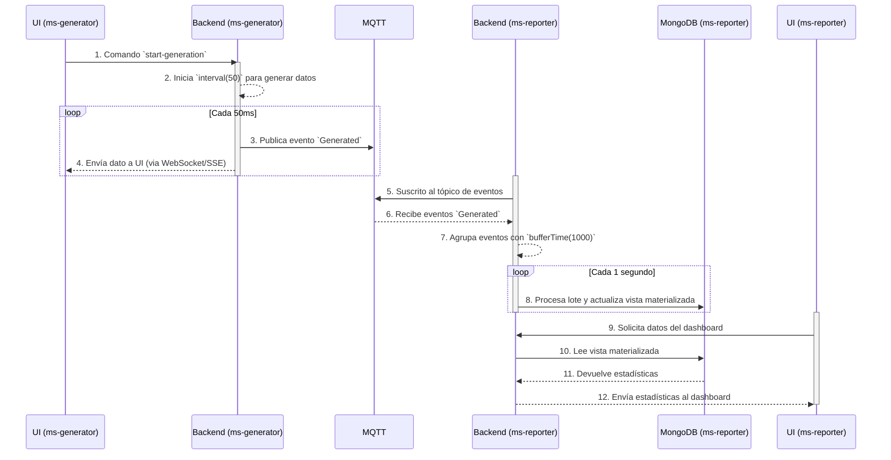

# Plan de Estudios Detallado: Semana 4

## Objetivo de la Semana

Al finalizar esta semana, el desarrollador será capaz de **desplegar, comunicar y optimizar microservicios de forma avanzada**. Habrá dominado:

1.  **Exposición y Aceleración de APIs:** Exponer servicios de forma segura con API Gateways y acelerar el desarrollo con plantillas.
2.  **Comunicación Asíncrona de Extremo a Extremo:** Implementar el flujo completo de publicación, consumo y manejo idempotente de eventos.
3.  **Combinación y Manejo de Errores con RxJS:** Combinar múltiples flujos de datos y manejar errores de forma robusta.
4.  **Optimización de Rendimiento en React:** Aplicar un bloque cohesivo de técnicas avanzadas, incluyendo memoización y virtualización.
5.  **Administración de BD y Mensajería:** Adquirir habilidades de administración de MongoDB y conocer sistemas de mensajería como NATS y Pub/Sub, distribuidas a lo largo de la semana.
6.  **Despliegue con Kubernetes y CI/CD:** Desplegar aplicaciones en Kubernetes y entender los fundamentos de un pipeline de CI/CD con GitLab.

## Modalidad de Acompañamiento y Soporte

*   **Foro de Dudas en Classroom:** Para preguntas asíncronas y discusiones técnicas detalladas.
*   **Sesiones de Q&A en Vivo:** 
    *   **lunes:** 3:00 PM - 4:00 PM
    *   **miercoles:** 9:00 AM - 10:00 AM y 3:00 PM - 4:00 PM
    *   **viernes:** 3:00 PM - 4:00 PM
*   **Google NotebookLM:** Herramienta recomendada para estudiar bajo las fuentes del currículo y acelerar la comprensión de conceptos complejos. Utiliza los documentos de cada path como fuentes de conocimiento.
*   **Asistentes de IA:** Se incentiva el uso de ChatGPT, GitHub Copilot, Gemini CLI y Gemini Code Assist para facilitar el entendimiento del código, depuración y exploración de conceptos.

### Resumen de Habilidades por Día y Path

| Día | Path 1: Arquitectura | Path 2: Framework | Path 3: Backend (RxJS) | Path 4: Frontend | Path 5: Persistencia | Path 6: DevOps/Herramientas |
|:--- |:--- |:--- |:--- |:--- |:--- |:--- |
| **1** | Patrón API Gateway | - | Combinación (`forkJoin`) | `React.memo` | Administración de MongoDB | - |
| **2** | Patrón Token de Acceso | - | Combinación (`race`) | Hooks (`useCallback`, `useRef`) | Monitoreo de MongoDB | Manifiestos de Kubernetes |
| **3** | Patrón Microservice Chassis | Flujo Completo de Eventos | - | Virtualización de Listas | Backup y Recuperación | - |
| **4** | Patrón Plantilla de Servicio | - | Combinación (`zip`) | Implementación de estrategias de rendimiento en FrontEnd | Logging y NATS | `kubectl apply` |
| **5** | Práctica Integral | Práctica Integral | `withLatestFrom`, `catchError`, `buffer` | Práctica Integral | Google Pub/Sub | GitLab CI/CD y Práctica |

---

## Día 1: Administración de BD y Exposición de APIs

### Introducción del Día

Arrancamos la semana 4 introduciendo desde el primer día los temas de persistencia. Aprenderás a usar las herramientas de administración de MongoDB. En paralelo, cubriremos cómo exponer servicios con API Gateways, cómo optimizar React con `React.memo` y combinaremos flujos con RxJS.

Hoy te enfocarás en los siguientes módulos:
*   **Módulo 1:** Patrón API Gateway (Path 1)
*   **Módulo 2:** Combinación con `forkJoin` (Path 3)
*   **Módulo 3:** Rendimiento con `React.memo` (Path 4)
*   **Módulo 4:** Administración de MongoDB (Path 5)

### Módulo 1: Patrón API Gateway (Path 1)
*   **Objetivo:** Entender cómo un API Gateway actúa como punto de entrada único para los microservicios.
*   **Recursos Web:**
    *   [Patrón: API Gateway (microservices.io)](https://microservices.io/patterns/apigateway.html) (1.5h)

### Módulo 2: Combinación con `forkJoin` (Path 3)
*   **Objetivo:** Aprender a combinar múltiples flujos que deben completarse.
*   **Recursos Web:**
    *   [Operador `forkJoin` (LearnRxJS)](https://www.learnrxjs.io/learn-rxjs/operators/combination/forkjoin) (1h)

### Módulo 3: Rendimiento con `React.memo` (Path 4)
*   **Objetivo:** Aprender la técnica de memoización para prevenir re-renders innecesarios.
*   **Recursos Web:**
    *   [Optimizando el Rendimiento con `React.memo` (React.dev)](https://react.dev/reference/react/memo) (1h)

### Módulo 4: Administración de MongoDB (Path 5)
*   **Objetivo:** Familiarizarse con las herramientas para administrar una base de datos MongoDB.
*   **Recursos Web:**
    *   [MongoDB Database Administrator Tools](https://learn.mongodb.com/courses/mongodb-database-administrator-tools) (2.5h)

---

## Día 2: Monitoreo, Seguridad y Despliegue en K8s

### Introducción del Día

Hoy continuaremos con el Path de persistencia, aprendiendo a monitorear nuestras bases de datos. También abordaremos la seguridad con tokens de acceso, la optimización de React con hooks y daremos los primeros pasos para desplegar en Kubernetes.

Hoy te enfocarás en los siguientes módulos:
*   **Módulo 1:** Patrón Token de Acceso (Path 1)
*   **Módulo 2:** Combinación con `race` (Path 3)
*   **Módulo 3:** Hooks de Rendimiento (Path 4)
*   **Módulo 4:** Monitoreo de MongoDB (Path 5)
*   **Módulo 5:** Manifiestos de Kubernetes (Path 6)

### Módulo 1: Patrón Token de Acceso (Path 1)
*   **Objetivo:** Comprender cómo propagar la identidad del usuario de forma segura.
*   **Recursos Web:**
    *   [Patrón: Token de Acceso (microservices.io)](https://microservices.io/patterns/security/access-token.html) (1h)

### Módulo 2: Combinación con `race` (Path 3)
*   **Objetivo:** Aprender a combinar flujos donde solo importa el primero que emita un valor.
*   **Recursos Web:**
    *   [Operador `race` (LearnRxJS)](https://www.learnrxjs.io/learn-rxjs/operators/combination/race) (1h)

### Módulo 3: Hooks de Rendimiento (Path 4)
*   **Objetivo:** Dominar `useCallback` y `useRef` para memoizar funciones y valores.
*   **Recursos Web:**
    *   [Hooks de Rendimiento: `useCallback` y `useRef` (React.dev)](https://react.dev/reference/react/useCallback) (1.5h)

### Módulo 4: Monitoreo de MongoDB (Path 5)
*   **Objetivo:** Aprender a monitorear las métricas clave de una base de datos MongoDB.
*   **Recursos Web:**
    *   [MongoDB Database Metrics & Monitoring](https://learn.mongodb.com/courses/mongodb-database-metrics-monitoring) (1h)

### Módulo 5: Manifiestos de Kubernetes (Path 6)
*   **Objetivo:** Entender cómo describir el estado deseado de una aplicación en Kubernetes.
*   **Recursos Web:**
    *   [Deployments (Kubernetes Docs)](https://kubernetes.io/docs/concepts/workloads/controllers/deployment/) (2.5h)

---

## Día 3: El Flujo Completo de Eventos y Listas Virtuales

### Introducción del Día

Hoy es un día clave. Nos sumergiremos de lleno en el flujo completo de eventos de Path 2. Continuaremos con el Path 5 aprendiendo sobre backup y recuperación, y en frontend, atacaremos el problema de rendimiento de listas masivas con virtualización.

Hoy te enfocarás en los siguientes módulos:
*   **Módulo 1:** Patrón Microservice Chassis (Path 1)
*   **Módulo 2:** Flujo Completo de Eventos (Path 2)
*   **Módulo 3:** Virtualización de Listas (Path 4)
*   **Módulo 4:** Backup y Recuperación en MongoDB (Path 5)

### Módulo 1: Patrón Microservice Chassis (Path 1)
*   **Objetivo:** Entender cómo crear un framework base con funcionalidades transversales.
*   **Recursos Web:**
    *   [Patrón: Microservice Chassis (microservices.io)](https://microservices.io/patterns/microservice-chassis.html) (1h)

### Módulo 2: Flujo Completo de Eventos (Path 2)
*   **Objetivo:** Implementar la comunicación entre microservicios mediante la publicación y consumo de eventos de dominio.
*   **Recursos Web:**
    *   [Flujo Completo de Eventos: Publicación, Consumo e Idempotencia](https://www.youtube.com/watch?v=dummy_video) (3h)

### Módulo 3: Virtualización de Listas (Path 4)
*   **Objetivo:** Aprender a renderizar grandes cantidades de datos de forma eficiente.
*   **Recursos Web:**
    *   [Virtualización de Listas con `react-window`](https://react-window.vercel.app/) (1.5h)

### Módulo 4: Backup y Recuperación en MongoDB (Path 5)
*   **Objetivo:** Entender las estrategias para realizar copias de seguridad y restaurar datos.
*   **Recursos Web:**
    *   [Self-Managed Backup & Recovery](https://learn.mongodb.com/courses/self-managed-backup-recovery) (1h)

---

## Día 4: Práctica de Frontend, Logging y Mensajería

### Introducción del Día

Hoy aplicaremos de forma práctica las estrategias de rendimiento de frontend. Seguiremos con el Path 5, aprendiendo sobre logging y el sistema de mensajería NATS. También estandarizaremos la creación de servicios y aplicaremos nuestros manifiestos de K8s.

Hoy te enfocarás en los siguientes módulos:
*   **Módulo 1:** Patrón Plantilla de Servicio (Path 1)
*   **Módulo 2:** Combinación con `zip` (Path 3)
*   **Módulo 3:** Implementación de estrategias de rendimiento en FrontEnd (Path 4)
*   **Módulo 4:** Logging y NATS (Path 5)
*   **Módulo 5:** `kubectl apply` (Path 6)

### Módulo 1: Patrón Plantilla de Servicio (Path 1)
*   **Objetivo:** Aprender a estandarizar y acelerar la creación de nuevos servicios.
*   **Recursos Web:**
    *   [Patrón: Plantilla de Servicio (microservices.io)](https://microservices.io/patterns/service-template.html) (1h)

### Módulo 2: Combinación con `zip` (Path 3)
*   **Objetivo:** Aprender a combinar flujos que emiten en pares.
*   **Recursos Web:**
    *   [Operador `zip` (LearnRxJS)](https://www.learnrxjs.io/learn-rxjs/operators/combination/zip) (1h)

### Módulo 3: Implementación de estrategias de rendimiento en FrontEnd (Path 4)
*   **Objetivo:** Ver una demostración de uso de `React.memo`, `useCallback`, `useRef` y `react-window`.
*   **Recursos Web:**
    *   [Implementación de estrategias de rendimiento en FrontEnd NebulaE](https://www.youtube.com/watch?v=dummy_video)

### Módulo 4: Logging y NATS (Path 5)
*   **Objetivo:** Entender el logging en MongoDB y conocer el sistema de mensajería NATS.
*   **Recursos Web:**
    *   [MongoDB Logging Basics](https://learn.mongodb.com/courses/mongodb-logging-basics) (1h)
    *   [NATS Concepts Overview](https://docs.nats.io/nats-concepts/overview) (1h)

### Módulo 5: `kubectl apply` (Path 6)
*   **Objetivo:** Aprender a aplicar cambios de configuración a los recursos de Kubernetes.
*   **Recursos Web:**
    *   [`kubectl apply` (Kubernetes Docs)](https://kubernetes.io/docs/reference/generated/kubectl/kubectl-commands#apply) (1.5h)

---

## Día 5: Práctica Integral y Tópicos Avanzados

### Introducción del Día

Llegamos al final de la semana. Hoy es un día para consolidar, explorando tópicos avanzados de RxJS, mensajería con Pub/Sub y CI/CD, culminando con una práctica integral.

Hoy te enfocarás en los siguientes módulos:
*   **Módulo 1:** Tópicos Avanzados de RxJS (Path 3)
*   **Módulo 2:** Google Pub/Sub (Path 5)
*   **Módulo 3:** Tópicos Avanzados de CI/CD (Path 6)
*   **Módulo 4:** Práctica Integral

### Módulo 1: Tópicos Avanzados de RxJS (Path 3)
*   **Objetivo:** Aprender a manejar errores y agrupar datos en flujos.
*   **Recursos Web:**
    *   [Operador `withLatestFrom` (LearnRxJS)](https://www.learnrxjs.io/learn-rxjs/operators/combination/withlatestfrom) (1h)
    *   [Manejo de Errores con `catchError` (LearnRxJS)](https://www.learnrxjs.io/learn-rxjs/operators/error_handling/catcherror) (1h)
    *   [Operador `bufferTime` (LearnRxJS)](https://www.learnrxjs.io/learn-rxjs/operators/combination/buffertime) (0.5h)
    *   [Operador `bufferCount` (LearnRxJS)](https://www.learnrxjs.io/learn-rxjs/operators/combination/buffercount) (0.5h)

### Módulo 2: Google Pub/Sub (Path 5)
*   **Objetivo:** Conocer el servicio de mensajería de Google Cloud.
*   **Recursos Web:**
    *   [Pub/Sub Basics](https://cloud.google.com/pubsub/docs/pubsub-basics) (1h)

### Módulo 3: Tópicos Avanzados de CI/CD (Path 6)
*   **Objetivo:** Aprender sobre GitLab CI/CD y cómo gestionar secretos.
*   **Recursos Web:**
    *   [Introduction to CI/CD (GitLab Docs)](https://docs.gitlab.com/ci/) (2h)
    *   [CI/CD variables (GitLab Docs)](https://docs.gitlab.com/ee/ci/variables/)

### Actividad Final Evaluativa: Sistema Reactivo de Análisis de Flotas Vehiculares

#### Introducción al Ejercicio

En esta evaluación final, construirás una Prueba de Concepto (PoC) para un sistema de análisis de flotas en tiempo real. El sistema se compone de dos microservicios distintos:

1.  **`ms-generator`:** Simula un flujo de datos de alta frecuencia, representando vehículos que se registran en un sistema a gran velocidad.
2.  **`ms-reporter`:** Consume este flujo de datos para procesar, agregar y presentar insights analíticos en un dashboard en tiempo real.

El propósito de este ejercicio es evaluar tu capacidad para diseñar y construir una arquitectura de microservicios reactiva y desacoplada, aplicando los patrones y tecnologías clave de la Semana 4. Demostrarás tu habilidad para:

*   Gestionar flujos de eventos de alta frecuencia con **RxJS**.
*   Implementar comunicación asíncrona robusta usando **MQTT**.
*   Construir interfaces de usuario de alto rendimiento con **React**, capaces de manejar grandes volúmenes de datos mediante **virtualización**.
*   Diseñar patrones de agregación eficientes (vistas materializadas) para la generación de reportes.
*   Aplicar el conjunto de patrones del framework NebulaE para una arquitectura orientada a eventos.

#### Diagrama de Flujo del Sistema



#### Diseño de la Interfaz de Usuario (UI)

**`ms-generator` - Consola de Simulación:**

```
+----------------------------------------------------------------------+
| GENERADOR DE FLOTA VEHICULAR                                         |
+----------------------------------------------------------------------+
|                                                                      |
|  Controles:                                                          |
|  [ Iniciar Simulación ] [ Detener Simulación ]                       |
|                                                                      |
|  Estado: Corriendo...   |   Vehículos Generados: 14,821               |
|                                                                      |
+----------------------------------------------------------------------+
| Vehículos Generados en Tiempo Real                                   |
+----------------------------------------------------------------------+
| | Año  | Tipo    | Potencia (HP) | Vel. Máxima (km/h) | Power Source |
|----------------------------------------------------------------------|
| | 2023 | SUV     | 250           | 220                | Electric     |
| | 1995 | PickUp  | 180           | 160                | Gas          |
| | 2008 | Sedan   | 150           | 190                | Hybrid       |
| | ... (Esta área debe ser una lista virtualizada y scrollable) ...   |
+----------------------------------------------------------------------+
```

**`ms-reporter` - Dashboard de Análisis:**

```
+----------------------------------------------------------------------+
| DASHBOARD DE ANÁLISIS DE FLOTA                                       |
+----------------------------------------------------------------------+
| Vehículos por Tipo        | Vehículos por Década      | Potencia (HP)  |
|---------------------------|---------------------------|----------------|
| SUV:      10,450 (40%)    | 1980s:  1,500 (5%)        | Mínimo: 75     |
| PickUp:    8,120 (30%)    | 1990s:  3,100 (12%)       | Máximo: 300    |
| Sedan:     8,120 (30%)    | 2000s:  8,500 (35%)       | Promedio: 192.5|
|                           | 2010s: 10,200 (40%)       |                |
|                           | 2020s:  3,390 (8%)        |                |
+---------------------------+---------------------------+----------------+
| Clasificación por Velocidad                                          |
|----------------------------------------------------------------------|
| Lento (<140 km/h):     5,200 (20%)                                    |
| Normal (140-240 km/h): 15,600 (60%)                                    |
| Rápido (>240 km/h):    5,200 (20%)                                    |
+----------------------------------------------------------------------+
```

---
### Parte 1: Implementación de `ms-generator`

**Objetivos Detallados:**

1.  **Generar Microservicio:** Ejecuta `@nebulae/cli` para crear un microservicio llamado `ms-generator` con el agregado `Vehicle`.
2.  **Backend - Lógica de Generación:**
    *   En la capa `backend`, implementa la lógica para los comandos `start-generation` y `stop-generation`.
    *   Utiliza RxJS para crear un flujo que emita un valor cada 50ms al iniciar. Un `interval(50)` controlado por un `takeUntil` que se active con el comando `stop-generation` es el patrón ideal.
    *   En cada emisión del intervalo, genera un objeto `Vehicle` con valores aleatorios para sus propiedades (`type`, `powerSource`, `hp`, `year`, `topSpeed`).
    *   Publica un evento `Generated` en el tópico MQTT `fleet/vehicles/generated` por cada vehículo creado.
3.  **Frontend - UI de Control y Visualización:**
    *   Implementa los botones "Iniciar" y "Detener".
    *   Para la visualización en tiempo real, puedes usar WebSockets o Server-Sent Events (SSE) para que el backend notifique al frontend de cada nuevo vehículo.
    *   La lista de vehículos **debe** usar el componente `FixedSizeList` de `react-window` para renderizar eficientemente miles de elementos.
    *   Los componentes que renderizan cada fila de la lista deben estar envueltos en `React.memo` para optimizar el rendimiento.

### Parte 2: Implementación de `ms-reporter`

**Objetivos Detallados:**

1.  **Generar Microservicio:** Ejecuta `@nebulae/cli` para crear `ms-reporter` con el agregado `VehicleStats`.
2.  **Backend - Consumidor por Lotes (Batch):**
    *   Configura el servicio para suscribirse al tópico MQTT `fleet/vehicles/generated`.
    *   Crea un `Subject` de RxJS a nivel de dominio. Todos los eventos MQTT que lleguen deben ser emitidos a través de este `Subject` usando `subject.next(event)`.
    *   En el `start del dominio, suscríbete al `Subject` y aplica el siguiente pipe: `this.events$.pipe(bufferTime(1000), filter(buffer => buffer.length > 0))`.
    *   En la suscripción de este pipe, recibirás un array de eventos (un lote). Itera sobre este lote para calcular las nuevas estadísticas.
    *   Actualiza el documento de estadísticas en MongoDB **una sola vez** por lote, usando operadores como `$inc` para los contadores y recalculando los promedios.
3.  **Backend - API de Reportes:**
    *   Define un `Query` de GraphQL (ej. `getFleetStatistics`) que lea y devuelva el documento único de la vista materializada.
4.  **Frontend - Dashboard:**
    *   Crea la interfaz del dashboard como se describe en el mockup.
    *   Utiliza Apollo Client para ejecutar la query `getFleetStatistics` y poblar los componentes del dashboard con los datos recibidos.

---
### Criterios de Evaluación (Actualizados)

| Criterio | Puntos | Descripción de la Evaluación |
| :--- | :--- | :--- |
| **Parte 1: `ms-generator`** | **(40 Puntos)** | |
| Backend y Publicación de Eventos | 15 | La lógica de generación respeta el intervalo de 50ms, se controla con Start/Stop y publica correctamente los eventos en MQTT. |
| Rendimiento del Frontend | 15 | Se implementa correctamente una **lista virtualizada** (`react-window`). Se aplican `React.memo` y `useCallback`. |
| Lógica de Control con RxJS | 10 | Se utiliza RxJS de forma efectiva en el backend para gestionar el stream de datos (ej. `interval`, `takeUntil`). |
| **Parte 2: `ms-reporter`** | **(50 Puntos)** | |
| Consumidor por Lotes (Batch) con RxJS | 25 | El consumidor utiliza un `Subject` y el operador **`bufferTime(1000)`** para procesar eventos en lotes. La escritura en BD ocurre solo una vez por segundo. La lógica es idempotente. |
| Lógica de Agregación | 15 | La lógica para calcular todas las estadísticas solicitadas (por tipo, década, velocidad y HP) es correcta y eficiente (usa operadores `$inc`). |
| API y Dashboard | 10 | La API de GraphQL expone las estadísticas y el dashboard las consume y presenta correctamente. |
| **Calidad General y Arquitectura** | **(10 Puntos)** | |
| Claridad y Estructura del Código | 10 | El código en ambos microservicios es limpio, sigue las convenciones del framework y demuestra una clara aplicación de los patrones de la Semana 4. |
| **TOTAL** | **100 Puntos** | |
